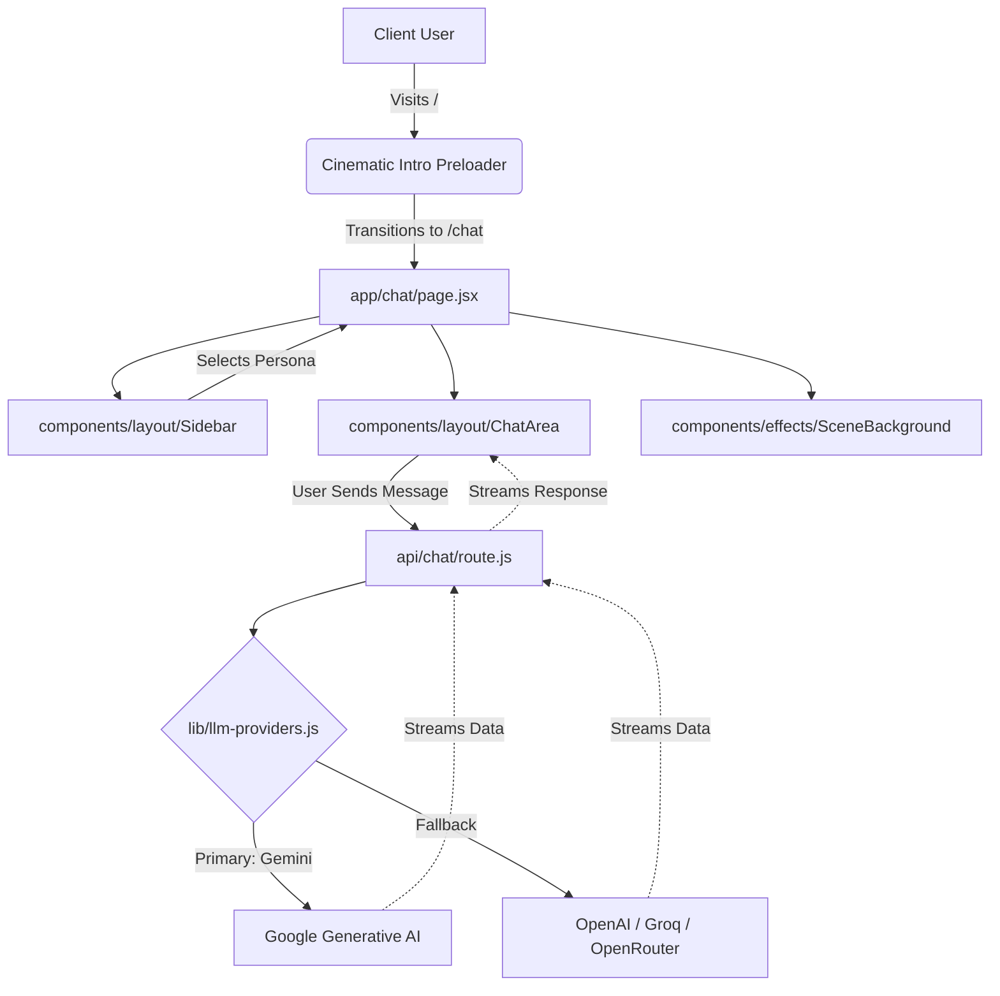
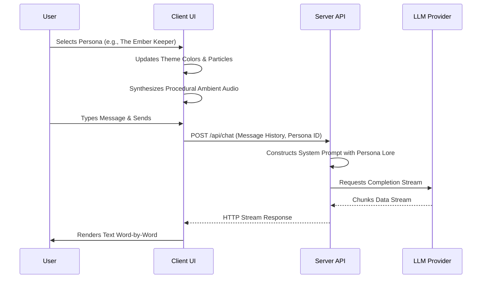

# Ashen Oracle

<div align="center">
  
  &nbsp;&nbsp;&nbsp;
  
  &nbsp;&nbsp;&nbsp;
  
  &nbsp;&nbsp;&nbsp;
  
</div>

Ashen Oracle is a dark-fantasy web application that serves as an immersive AI assistant for game lore, combat strategies, and equipment upgrades. Inspired by the grim and atmospheric worlds of Souls-like games, it provides users with distinct "Guides"—each possessing unique personalities, thematic styling, and procedural ambient audio—to answer questions and assist in their journeys.

**Live Deployment:** [https://ashen-oracle.vercel.app](https://ashen-oracle.vercel.app)

## 🌟 Features

- **Cinematic Experience:** Features a fullscreen video preloader that acts as an atmospheric entry point before transitioning seamlessly into the application.
- **Multiple AI Guides (Personas):** Choose from specialized guides like The Ember Keeper, The Oathbound Knight, or The Hollow Scholar. Each guide alters the UI theme, dialogue style, and system prompt.
- **Dynamic Audio System:** Procedural ambient soundscapes (e.g., crackling fire, howling wind, echoing tombs) mapped to the selected guide using the Web Audio API.
- **Robust LLM Architecture:** Powered by the Vercel AI SDK, with a built-in provider cascade. Primary responses are handled by Google's Gemini models, with easy configurations to fallback to Groq, OpenRouter, or local Ollama instances.
- **Gothic Aesthetics:** Custom CSS Modules featuring deep blacks, muted golds, steel blues, and blood reds, complete with custom glyphs and glassmorphism elements.

## 🛠 Tech Stack

- **Framework:** Next.js (App Router, Turbopack)
- **UI Library:** React
- **AI Integration:** Vercel AI SDK
- **Model Providers:** Google Generative AI (Gemini), OpenAI Compatible (Groq, OpenRouter)
- **Styling:** Vanilla CSS Modules (`.module.css`)
- **Icons:** Lucide React
- **Audio:** Native HTML5 Web Audio API

## 📂 Project Structure

```text
Ashen Oracle/
├── docs/                   # Architecture and technical documentation
├── public/                 # Static assets, cinematic intro video, and fonts
├── app/
│   ├── api/
│   │   └── chat/           # Serverless API endpoint for LLM handling
│   ├── chat/               # Main application interface and chat view
│   ├── layout.jsx          # Root HTML layout and global providers
│   └── page.jsx            # Entry point & cinematic intro orchestrator
├── components/
│   ├── effects/            # Visual & Audio Effects (CinematicIntro, SceneBackground)
│   ├── layout/             # Main UI Components (ChatArea, Sidebar)
│   └── ui/                 # Reusable UI elements (Button, CharacterCard)
├── lib/
│   ├── llm-providers.js    # Provider configuration (Gemini, Groq, OpenRouter)
│   ├── personas.js         # Data structure for the different Guides
│   ├── modes.js            # Tone/Style modifiers for the AI
│   └── soundManager.js     # Procedural Web Audio API synthesizer
├── .env.example            # Example environment variables
└── README.md
```

## 🏛 Architecture

Ashen Oracle follows a modern Next.js (App Router) architecture tailored for building AI-integrated conversational interfaces with rich, dynamic front-end experiences.



## 🔄 Application Workflow



## 🚀 Getting Started

### Prerequisites
- Node.js (v18 or higher recommended)
- API Keys for your preferred LLM providers (Google Gemini, Groq, OpenRouter, etc.)

### Installation

1. **Clone the repository:**
   ```bash
   git clone https://github.com/arupb4531/Ashen-Oracle.git
   cd ashen-oracle
   ```

2. **Install dependencies:**
   ```bash
   npm install
   ```

3. **Configure Environment Variables:**
   Create an `.env` or `.env.local` file in the project root:

   ```bash
   # Primary Provider (Required)
   GEMINI_API_KEY=your_google_gemini_api_key_here

   # Fallback Providers (Optional)
   GROQ_API_KEY=your_groq_api_key_here
   OPENROUTER_API_KEY=your_openrouter_api_key_here
   ```

   Tip: You can quickly copy the example file by running:
   ```bash
   cp .env.example .env
   ```

4. **Run the development server:**
   ```bash
   npm run dev
   ```

5. **Open the application:**
   Navigate to `http://localhost:3000` in your browser.

## 📄 License

This project is licensed under the [MIT License](./LICENSE).
